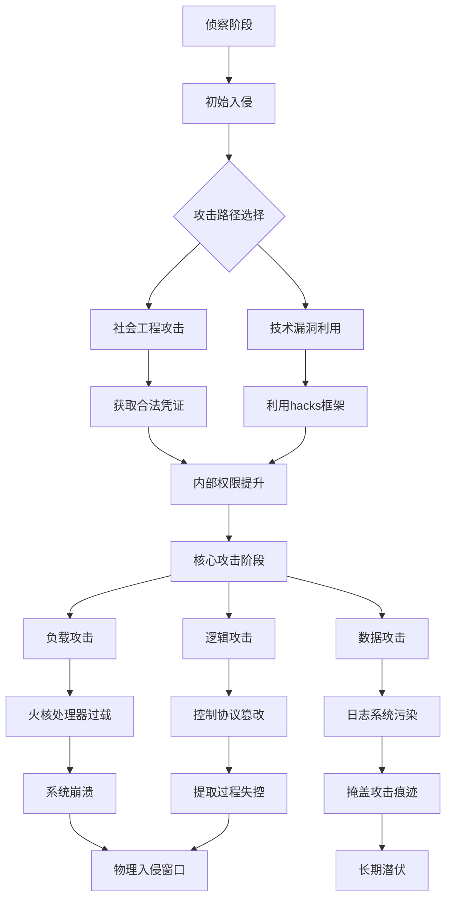

# 霜影核能控制台系统文档

> 5067年 · 曲速粒子反应提取装置 · 全宇宙能源战争前线

## 📁 项目概述

### 核心定位

**霜影能量集团中央控制系统**，用于监控、配置与优化“曲速粒子反应提取装置”，从高密度能源物质“霜影核能”中安全提取能量，并为能源贫困星球提供商业能源供应。

### 时代背景

- **纪元**：5067年，曲速旅行普及时代
- **能源危机**：宇宙中73%的殖民星球处于“能源贫困线”以下
- **技术突破**：霜影核能提取技术——利用曲速粒子触发能量释放
- **安全威胁**：“猎人”黑客组织对能源设施的针对性网络攻击

### 系统核心矛盾

**人道主义能源援助使命** ← vs → **星际犯罪集团的觊觎与攻击**

---

## � 技术实现细节

## �🖥️ 界面架构解析

### 1. 主显示区 - 反应堆曲线图

```plaintext
功能：实时可视化曲速场与霜影核能的共振波形
正常状态：平滑的Ψ型振荡曲线
异常指示：
  - 波形畸变 → 提取过程失稳
  - 峰值异常 → 外部信号干扰
  - 曲线静止 → 系统冻结（可能被接管）
```

### 2. 控制配置区 - Configuration Bar

```plaintext
层级结构：
├── 基础协议层（必需配置）
│   ├── 曲速场稳定系数 Ψ
│   ├── 提取速率限制
│   ├── 安全阈值边界
│   └── 输出目标设定
├── 高级优化层（可选）
│   ├── 共振频率微调
│   ├── 能量回收算法
│   └── 预测性维护参数
└── 紧急协议层（隐藏）
    ├── 硬停机序列
    ├── 物理隔离触发
    └── 自毁协议（最终手段）

安全机制：
- 首次启动强制配置（“未配置”浮动窗口）
- 配置变更需双重身份验证
- 所有配置操作记录至安全日志
```

### 3. 代码框架区 - “Hacks”开发接口

```plaintext
设计初衷：高级诊断与性能优化平台
├── 官方用途：
│   ├── 实时调试脚本
│   ├── 自定义监控插件
│   ├── 应急响应自动化
│   └── 性能压测工具
└── 攻击面暴露：
    ├── 未签名脚本执行漏洞
    ├── 内存访问权限过大
    ├── 系统调用无沙箱隔离
    └── 日志记录不完整

当前状态：数字战场的主要入口点
```

### 4. 操作控制台 - CNC火核处理器监控

```plaintext
核心指标：
├── 操作效率（核心KPI）
│   ├── 定义：实际输出/理论最大输出
│   ├── 安全范围：20%-100%
│   └── 优化目标：接近100%但不超载
├── 处理器状态
│   ├── 负载率（%）
│   ├── 核心温度（°C）
│   ├── 内存完整性（%）
│   └── 指令吞吐量（TIPS）
└── 能源输出
    ├── 瞬时功率（EW）
    ├── 累计输出（EW·h）
    ├── 客户输送状态
    └── 储备能量水平

哲学指导：
“效率是美德，超载是原罪”
——霜影能源安全第一定律
```

### 5. 日志系统 - 数字生命体征监视器

```plaintext
颜色编码体系：
🟢 绿色 - STATUS_NORMAL
  ├── 系统健康状态
  ├── 授权操作成功
  ├── 例行维护完成
  └── 能量输送确认
  → 叙事氛围：秩序、安全、可控

🟠 浅红色 - STATUS_WARNING  
  ├── 异常检测
  ├── 未授权访问尝试
  ├── 性能偏离基准
  ├── 外部接口异常
  └── 安全模块触发
  → 叙事氛围：警惕、早期威胁、行动窗口

🔴 红色乱码 - STATUS_CRITICAL
  ├── 系统核心受损
  ├── 处理器过载
  ├── 数据流污染
  ├── 控制协议冲突
  └── 硬件故障
  → 叙事氛围：恐慌、失控、生存危机

乱码语义学：
  部分可读乱码 = 系统在谵妄中传递关键信息
  完全乱码流 = 数字脑死亡的前兆
  日志静默 = 系统已离线或被完全接管
```

---

## ⚔️ 威胁模型：猎人黑客攻击模式

### 攻击生命周期



### 具体攻击手法

1. **处理器饱和攻击**
   - 无限递归脚本
   - 浮点运算轰炸
   - 内存分配洪水

2. **控制流劫持**
   - 配置参数篡改
   - 安全阈值绕过
   - 紧急协议禁用

3. **数据层面攻击**
   - 日志注入污染
   - 传感器数据欺骗
   - 监控视频替换

4. **物理协同攻击**
   - 数字攻击制造物理漏洞
   - 内外人员配合
   - 精确时机选择（维护窗口、能量输送高峰）

---

## 🛡️ 防御体系与操作指南

### 多层次防御策略

```plaintext
第1层 - 边界防御
  ├── 网络访问控制（NAC）
  ├── 协议深度检测
  ├── 异常流量识别
  └── 蜜罐系统部署

第2层 - 身份与访问管理  
  ├── 多因素认证（生物+神经+硬件）
  ├── 最小权限原则
  ├── 会话行为分析
  └── 特权访问管理（PAM）

第3层 - 应用安全
  ├── hacks框架沙箱强化
  ├── 输入验证与净化
  ├── 内存安全保护
  └── 实时代码审计

第4层 - 监控与响应
  ├── 全链路日志收集
  ├── AI异常行为检测
  ├── 自动应急响应
  └── 手动覆盖控制台
```

### 操作员应急响应协议

#### 威胁等级判定表

| 日志颜色 | 乱码比例 | 处理器负载 | 威胁等级 | 响应动作 |

|---------|----------|------------|----------|----------|
| 全绿 | 0% | <60% | 正常 | 常规监控 |
| 浅红 | <10% | 60%-80% | 低 | 加强监控，准备预案 |
| 浅红 | 10%-30% | 80%-90% | 中 | 启动一级响应，部分功能限制 |
| 红+乱码 | 30%-70% | 90%-100% | 高 | 启动二级响应，关键系统隔离 |
| 全红乱码 | >70% | >100% | 危急 | 紧急停机，物理断网，武装准备 |

#### 关键决策点

1. **效率 vs 安全抉择**
   - 80%效率：安全边际充足
   - 90%效率：风险开始累积  
   - 95%效率：每一分钟都在赌博
   - 100%效率：理论极限，实际等于超载

2. **日志解读技能树**
   ```
   新手：识别颜色变化
   ↓
   熟练：理解警告信息
   ↓   
   专家：从乱码中提取关键信息
   ↓
   大师：预测攻击模式，预判下一步
   ```

3. **hacks框架使用准则**
   - 原则：能不用就不用
   - 必需时：最小权限，最短时间
   - 永远假设：每个自定义脚本都可能被武器化

---

## 🎮 叙事与游戏化设计

### 玩家角色定位

**霜影能源设施安全官** - 在以下三重压力下工作：

1. **运营压力**：满足能源输出目标
2. **安全压力**：抵御持续的黑客攻击  
3. **道德压力**：能源分配的社会责任

### 叙事节奏控制

```
平静期（绿色日志主导）
  → 建立日常感，熟悉界面
  → 培养玩家的“安全错觉”

扰动期（零星浅红警告）
  → 埋下伏笔，制造悬念
  → 玩家开始主动侦查

攻击期（乱码出现并增多）
  → 紧张感陡升，时间压力
  → 考验玩家的应急决策能力

危机期（系统部分/完全失控）
  → 生存挑战，有限资源
  → 可能引入物理层威胁（猎人实体入侵）

恢复期（系统重启与复盘）
  → 后果呈现，故事推进
  → 玩家能力成长，解锁新工具
```

### 隐藏叙事线索示例

1. **日志中的幽灵信号**
   ```
   [INFO] 收到来自“遗忘边陲”的感谢信号...
   [WARN] 同一来源的感谢信号重复327次...
   [ERROR] 信号源验证失败：“遗忘边陲”已于50年前毁灭
   ```

2. **自我意识的痕迹**
   ```
   [SYSTEM] 火核处理器负载：47%
   [SYSTEM] 我在思考...负载：47%
   [SYSTEM] ERROR：未授权的第一人称日志
   ```

3. **来自过去的警告**
   ```
   [ARCHIVE] 2157.04.12 - 首次超载实验记录
   [ARCHIVE] “如果我们当时停下就好了...”
   [ARCHIVE] 数据损坏 - 后续记录不可读
   ```

---

## 🔮 技术深度：科幻设定解释

### 火核处理器技术原理

```
概念：基于“可控微奇点”的计算单元
物理基础：
  - 利用量子引力效应进行并行计算
  - 每个核心是一个自我维持的时空曲率泡
  - 热量排放通过微型虫洞导向散热维度

脆弱性解释：
  过载 → 奇点稳定性下降 → 量子退相干 → 
  计算错误率指数上升 → 宏观表现为乱码和崩溃
  
攻击放大效应：
  恶意代码可以引起“共振塌缩” - 
  一个核心的失败会链式影响整个处理器阵列
```

### 曲速粒子提取机制

```
霜影核能特性：
  - 存在于超维晶体结构中
  - 常规手段无法触发能量释放
  - 需要特定频率的曲速场共振

提取过程：
  1. 产生精密的曲速粒子流（Ψ场）
  2. 与霜影晶体产生共振
  3. 引发维间能量转移
  4. 捕获并稳定化能量输出

安全风险：
  - 共振频率偏差 → 能量释放失控
  - 曲速场不稳定 → 时空局部扭曲
  - 提取中断 → 能量逆流爆炸
```

---

## 📊 系统状态速查表

### 快速诊断流程

```
观察日志颜色
  → 全绿：继续监控，记录基准
  → 浅红：定位警告来源，评估威胁等级
  → 红+乱码：启动应急协议，参考以下步骤：

应急协议速查：
1. 处理器负载 >90%？
  是 → 立即限制非核心计算任务
  否 → 进入步骤2

2. 乱码比例 >30%？
  是 → 启动日志净化程序，准备手动控制
  否 → 进入步骤3

3. 能量输出曲线异常？
  是 → 切换到备用控制回路
  否 → 深度扫描系统，寻找隐藏进程

4. 任何“未知协议”警告？
  是 → 物理隔离受影响模块
  否 → 继续监控，保持最高警戒
```

### 关键阈值备忘

```
绝对不能超过的红线：
- 处理器负载：100%（实际95%即应采取措施）
- 核心温度：150°C（安全上限120°C）
- 曲速场稳定性指数：ΔΨ < 0.01
- 能量逆流检测：任何非零值都是紧急情况

高效运行甜点区：
- 处理器负载：65%-80%
- 操作效率：85%-95%
- 提取室压力：2-3个标准宇宙大气压
- 输出波动率：< ±2%
```

---

## 💎 核心设计哲学总结

### 界面设计的双重性

1. **功能性界面**：一个高效的能量管理工具
2. **叙事性界面**：一个正在发生的故事的舞台
3. **游戏性界面**：一个需要玩家技能与决策的挑战场

### 安全叙事的三个层次

```
表层：操作指南与规程
中层：系统设计与架构安全
深层：宇宙尺度下的道德与生存哲学
```

### 最终愿景

> 创造一个让玩家**同时**感受到：
> - 工程师解决技术问题的成就感
> - 安全专家抵御攻击的紧张感  
> - 科幻主角参与宏大叙事的史诗感
>
> 的所有体验，而这一切都发生在一个看似普通的控制台界面中。

---

**文档版本**：1.0 · 霜影纪元5067年  
**保密等级**：Ω级（仅限授权安全官访问）  
**最后更新**：系统时间戳 5067-Ψ-42.8.15:32:47  
**警告**：任何未授权访问将触发神经印记擦除协议
